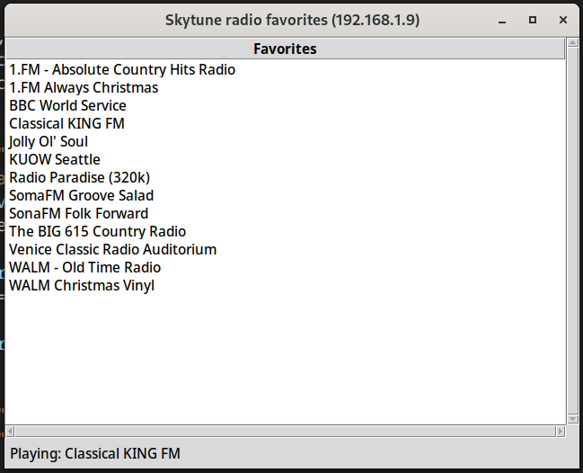

# py-skytune

Python API, CLI and UI for skytune radios

# Quick start

## API
```python


from py_skytune.radio import Radio
radio = Radio(ip_address="192.168.1.9")

# Get favorites
favs = radio.favorites
print(f"\nFavorites{'-'*50}")
for fav in favs:
    print(fav.uid, fav.name, fav.location, fav.genre, fav.url)

# Play a favorite
playing = radio.play_favorite(1)
print(playing)

# Sort the favorites
sorted_favorites = radio.sort_favorites(reverse=False)
for fav in sorted_favorites:
    print(fav.uid, fav.name, fav.location, fav.genre, fav.url)

```

## CLI

```
$ export SKYTUNE_IP_ADDRESS="192.168.1.9"
$ skytune favorites

1 1.FM - Absolute Country Hits Radio Switzerland Various http://strm112.1.fm/acountry_mobile_mp3
2 1.FM Always Christmas Switzerland Holiday & Seasonal https://strm112.1.fm/christmas_mobile_mp3
3 BBC World Service United Kingdom Various http://stream.live.vc.bbcmedia.co.uk/bbc_world_service
4 Classical KING FM United States Various https://classicalking.streamguys1.com/king-fm-aac-128k

$ skytune play 1
```

## UI

```
$ skytune
```




## Documentation

See the `docs` directory or the source.

## Rebuild docs

```
pydoc-markdown -m py_skytune.radio -I src > docs/radio.md
pydoc-markdown -m py_skytune.favorites -I src > docs/favorites.md
pydoc-markdown -m py_skytune.genre -I src > docs/genre.md    
pydoc-markdown -m py_skytune.locations -I src > docs/locations.md
```